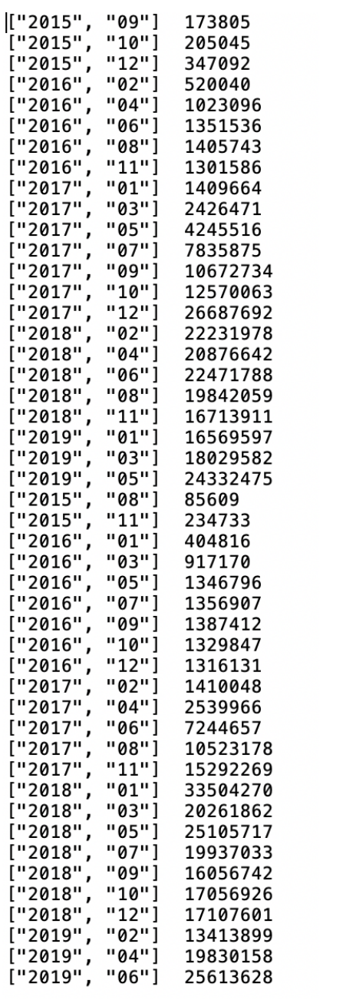
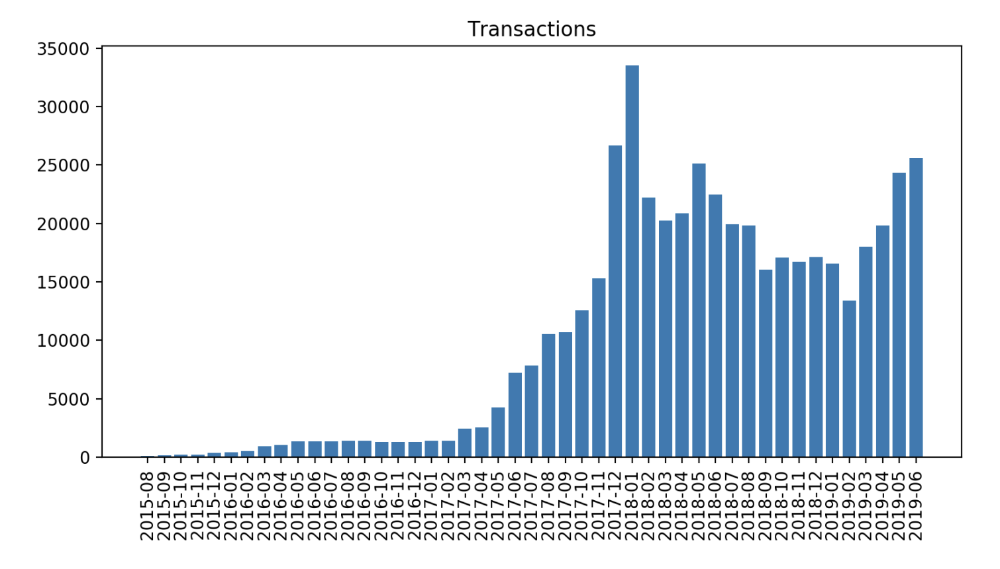

# Big-Data-analysis-Ethereum-transactions
Analysis of full set of transactions which have occured on the Ethereum network

MapReduce.py is a MapReduce job to process the number of transactions occuring every month between the start and the end of the dataset.

spark.py is a Spark Job to evaluate the top 10 smart contracts by total Ether received

**This image show the output of the MapReduce job ([Year, Month],  numberOfTransactions)**

**Barchart of the number of transactions created using matplotlib**

